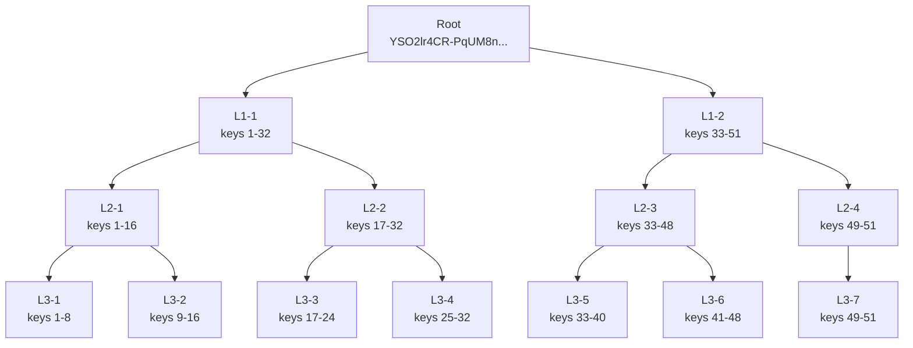

# Live Merkle Tree Snapshot

- Source: `http://127.0.0.1:8200`
- Root hash: `YSO2lr4CR-PqUM8nuThbUVF8t4RoNelwc9uqX9zsW_g`
- Epoch: `1772984567`
- Root signer kid: `root-ml-dsa-44`
- Current leaf count: `51`

## Compact Visual

## Leaf Order

1. `-IGWQr1qz5rlHkirBLziHQ`
2. `-IRpTY49d4ntCdwOXu_s2A`
3. `-sJ6qkOagAFyDrCfjzeLUw`
4. `3QwxsaWW41tI5mY-oByKdg`
5. `4de1hcocVII1gXBJgnl5PQ`
6. `6iuOBxCmLHWGlHgIdwgMfw`
7. `8zP8nGJE-5UuWp1Ob5gWvw`
8. `9WUlifMlcTdJUKsmxbrdtw`
9. `9Zx45Mw822FrFeTS-C8uZQ`
10. `B2h8VgPXi1R7KJAh3W6TjA`
11. `D1DJz7GqMqpEDuEmT06Gsg`
12. `DY4MSUK0XrF_TpOhW7vjyg`
13. `EDq5XfO92xhH7O-haTsmrg`
14. `G82v4i460eOHVQ1ZFwiEqg`
15. `Gd8WYtzddxqgtaV8PBPOaw`
16. `I1hzHzm3E3PZm9jKHR-y5Q`
17. `KLXdoma7waqHlv5v46k3tQ`
18. `QEF6w3BaO5bBQSJhAo5B7g`
19. `RYwThmVUb38mrfY5dWTn_w`
20. `U54LUcoXDBtk4jJqh1BCoQ`
21. `UM2f123FATtkp3yKqsX2Qg`
22. `VNVkN-RRwfOpdVCE1d8PQQ`
23. `WJjJesHUQTFK3dlblTaxlA`
24. `WcWYQk94bZfDsoC0fus9Hw`
25. `X8u9T4qoTP7-tygj5pm8NA`
26. `Z0mdkVnPxrGwhoaX6FOtbg`
27. `ZFi-3RHa02GanU8gWSM53Q`
28. `Zdp1N4uIybn57FoGho5Ejg`
29. `bhyCbfF9Rj3174eIgJjfDw`
30. `dNSOSjFLscTzEfkAa5b1hA`
31. `demo-client-verify-1`
32. `gKUVQBCnQXIP6tygNFnPgQ`
33. `hHrc7myEwRmAH_3A8cd1wQ`
34. `iYsp6DXJPhXX09NDA9Z0LQ`
35. `manual-ml-dsa-44-key-1`
36. `manual-ml-dsa-44-key-2`
37. `n_mQ6ZCvgeB4insiHpe5DA`
38. `puBYKPgWOlRnidzHN95dKA`
39. `rAJmtAcg0ikK4WIJEEC5tQ`
40. `root-dilithium2`
41. `root-dilithium2-1`
42. `root-dilithium2-2`
43. `root-dilithium2-3`
44. `root-dilithium2-4`
45. `sVfoxoU7mV-QA0k4Y5YaCw`
46. `tso3eaWXocV55pgOwWhXNw`
47. `uJDYm-rYy7je7f9l5gCHZA`
48. `w30H8P2v_mQjLIRgRlOpdw`
49. `wmfHvrCI0og82z_pCNfM8w`
50. `yb9QfChBJNPfP9uN-Z0uIw`
51. `zGRaz640ZyyFYwsKquVjSg`